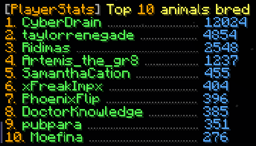

   

## About
PlayerStats is a Minecraft server plugin that adds a command to view player statistics in 
top-10 format or individually. Currently supports version **1.18.2** on platforms:
- Bukkit
- Spigot
- Paper
- Purpur

## Features 
* **Easy to use**
   - One central command that can:
     - Explain **how to use** the plugin with `/statistic`
       
     - Show you the **top 10** on your server for all possible statistics with `/statistic ... top`
       
     - See those same statistics for any **individual player** with `/statistic ... player`
       
     - Guide you through the available options while you type with an extensive **tab-complete** feature
       

* **No set-up required**
   - PlayerStats will work correctly regardless of how long your server has already existed - it doesn't 
     have to be present when you start a new world
   - Data is retrieved directly from already existing playerfiles, so you don't have to 
     set up a database, use scoreboards, or anything of the sort

* **Safe**
   - PlayerStats uses **multi-threading** to ensure server performance does not suffer and 
     players cannot crash the server by spamming its commands
   - This also means that for small to medium-sized servers, calculating statistics will be very **fast**   
     **For large servers (1000+ players), please read the disclaimer below**  

* **Customizable**  
    - You can customize the following:
      - Only show statistics for **whitelisted** players
      - Exclude statistics from **banned** players
      - Limit statistics based on when a player **last joined**.  
        This option can be particularly useful if you have had a lot of players join your server in the past
        whose statistics aren't of particular interest to your current player-base.
        On top of that, limiting the amount of players shown in the top 10 will greatly increase performance speed.
      - The **colors** you want the output to be
      - Whether you want the output to have additional **style**, such as italics 
    - You can configure the following **permissions**:
      - `playerstats.stat` for using the general command (true for everyone by default)
      - `playerstats.reload` for reloading the config (only for OP players by default)

## Disclaimer
How PlayerStats performs, will heavily depend on the amount of unique players that have joined 
your server, and on the specs of the machine it is running on. I have done elaborate testing on 
my local server, and it is currently also running on the SMP I play on. Looking up an individual
statistic is always nearly instant, but for a **top statistic** it can vary. For example: 
with 110 unique players, it takes about 0.1 seconds to calculate a top statistic on my SMP. 
With the same playerdata, my laptop takes 0.3 seconds to calculate the same thing.  

If you have a large amount of unique players (1000+), you could run into performance issues. 
If you notice it takes a long time to calculate top statistics, I recommend limiting the amount
of included players by setting a `number-of-days-since-last-joined` limit in the config.
Additionally, you could revoke the permission `playerstats.stat` for most players, and only
allow staff to use it, for example.  

I am working to improve performance for larger servers in the future, 
and I'd love to hear feedback on how the plugin is performing!

## Author Info
I am a relatively new programmer, and this is one of my first projects. I greatly enjoyed making it, 
and I tried to make it as efficient as I could. If you have any questions, remarks, or suggestions, 
please let me know! You can find me [here](https://github.com/Artemis-the-gr8) on GitHub. 

## Licence
PlayerStats is licenced under the MIT licence. Please see [LICENCE](LICENSE) for more information.
