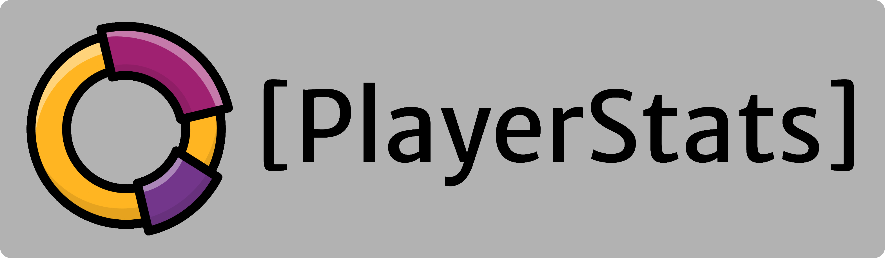
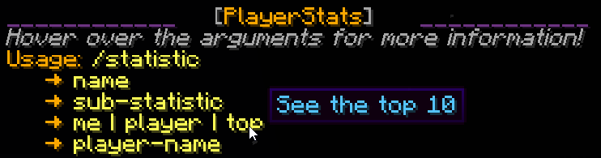
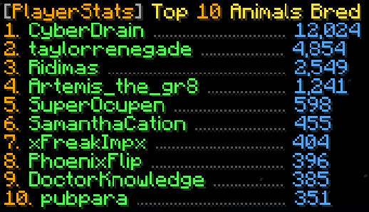
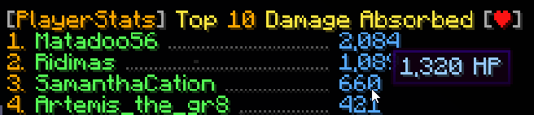
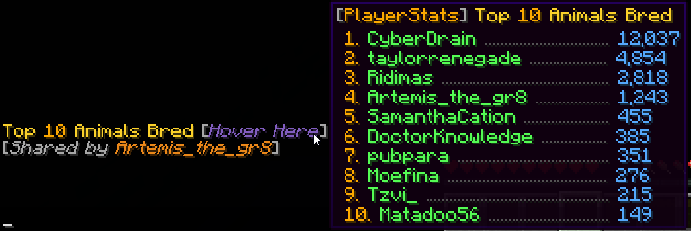
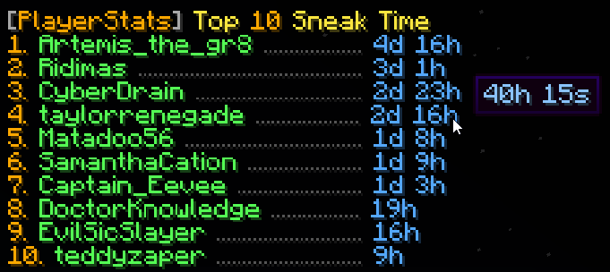
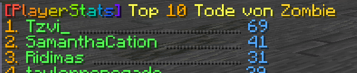

<p align="center">
   
</p>


## About
PlayerStats is a Minecraft server plugin that adds a command to view player statistics in 
top-10 format or individually. Currently tested on all versions between **1.16.5** and **1.21.5** on platforms:
- Bukkit
- Spigot
- Paper
- Purpur

(It's possible PlayerStats works on other platforms too, but these are the ones I have explicitly tested.)

&nbsp;

## Features 
* **Easy to use**
  - One central command that can:
    - Explain **how to use** the plugin with `/statistic`
      
    - Show you the **top 10** on your server for all possible statistics with `/statistic ... top`
      
    - See those same statistics for any **individual player** with `/statistic ... player`
      
    - Or look up the **combined total** of everyone on your server
      
    - Guide you through the available options while you type with an extensive **tab-complete** feature
      
    - See the output in a **readable format** that makes sense in the Minecraft world, with more information in hover-text:
      
    - **Share statistics** that you look up with the other players in chat:
      


* **No set-up required**
   - PlayerStats will work correctly regardless of how long your server has already existed - it doesn't 
     have to be present when you start a new world
   - Data is retrieved directly from already existing playerfiles, so you don't have to 
     set up a database, use scoreboards, or anything of the sort


* **PlaceholderAPI support**
   - Placeholders are added in a separate expansion, which can be found on [GitHub](https://github.com/Artemis-the-gr8/PlayerStatsExpansion), in the PlaceholderAPI [eCloud](https://api.extendedclip.com/expansions/playerstatsexpansion/), or downloaded in-game with `/papi ecloud download PlayerStats`
   - For more information about the placeholders, see the expansion's [GitHub](https://github.com/Artemis-the-gr8/PlayerStatsExpansion)!


* **Safe**
   - PlayerStats uses **multi-threading** to ensure server performance does not suffer and 
     players cannot crash the server by spamming its commands
   - This also means that calculating statistics will be very **fast**    


* **Customizable**  
    - You can customize the following (and more):
      - Choose which **range of units** you want to display your time-, damage- and distance-based statistics in:
        
      - **Automatically translate** statistics to the language of the client that views them, or customize the statistic-names through the **language.yml** file
      - Use festive formatting, or enable rainbow mode whenever!
           
      - Only show statistics for **whitelisted** players
      - Exclude statistics from **banned** players
      - Exclude statistics from specific players with `/statexclude`
      - Limit who is allowed to **share statistics** in chat and how often players can share
      - Limit statistics based on when a player **last joined**.  
        This option can be particularly useful if you have had a lot of players join your server in the past
        whose statistics aren't of particular interest to your current player-base.
        On top of that, limiting the amount of players shown in the top 10 can greatly increase performance speed.
      - The **colors** you want the output to be
      - You can go for default Minecraft chat colors, or use **hex colors**!
      - Whether you want the output to have additional **style**, such as italics 
    - You can configure the following **permissions**:
      - `playerstats.stat` for using the general command (true for everyone by default)
      - `playerstats.share` for sharing statistics in chat (true for everyone by default)
      - `playerstats.reload` for reloading the config (only for OP players by default)
      - `playerstats.exclude` to exclude players from top- and server-statistics (only for OP players by default)

&nbsp;

## API Usage
To import the PlayerStats API with Maven, add the following dependency and repository to your POM.xnl:

```xml
<repositories>
    <repository>
        <id>sonatype-oss-snapshots1</id> <!-- the OSSRH repository for snapshots -->
        <url>https://s01.oss.sonatype.org/content/repositories/snapshots/</url>
     </repository>
</repositories>
 
<dependencies>
    <dependency>
        <groupId>io.github.ithotl</groupId>
        <artifactId>PlayerStats</artifactId>
        <version>2.0-SNAPSHOT</version>
        <scope>provided</scope>
    </dependency>
</dependencies>
```
You can download the sources and Javadocs through your code editor, or visit the Javadocs [here](https://s01.oss.sonatype.org/service/local/repositories/snapshots/archive/io/github/ithotl/PlayerStats/2.0-SNAPSHOT/PlayerStats-2.0-20230228.110241-1-javadoc.jar/!/com/artemis/the/gr8/playerstats/api/PlayerStats.html).  
To get an instance of the API, you can do the following:

```java
PlayerStats playerStats = PlayerStats.getAPI();
```

&nbsp;

## Author Info
I am a relatively new programmer, and this is one of my first projects. I greatly enjoyed making it, 
and I tried to make it as efficient as I could. If you have any questions, remarks, or suggestions, 
please let me know! You can find me [here](https://github.com/Artemis-the-gr8) on GitHub. 

&nbsp;

## Licence
PlayerStats is licenced under the MIT licence. Please see [LICENCE](LICENSE) for more information.
